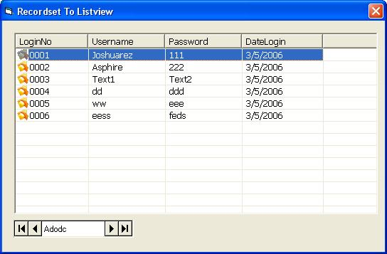



## Binding Recordset To Listview

### Description

This code will bind any recordset to listview, this is a function i made... im looking for any similar code for this and i cant find short code so i made one myself.I think this one of the shortest code to bind any record to any listview so you wont code any.
 
### More Info
 

             |
---                |---
**Submitted On**   |2006-03-06 21:42:50
**By**             |[Ariston L\. Bautista](https://github.com/Planet-Source-Code/PSCIndex/blob/master/ByAuthor/ariston-l-bautista.md)
**Level**          |Advanced
**User Rating**    |4.7 (14 globes from 3 users)
**Compatibility**  |VB 6\.0
**Category**       |[Databases/ Data Access/ DAO/ ADO](https://github.com/Planet-Source-Code/PSCIndex/blob/master/ByCategory/databases-data-access-dao-ado__1-6.md)
**World**          |[Visual Basic](https://github.com/Planet-Source-Code/PSCIndex/blob/master/ByWorld/visual-basic.md)
**Archive File**   |[Binding\_Re197826362006\.zip](https://github.com/Planet-Source-Code/ariston-l-bautista-binding-recordset-to-listview__1-64549/archive/master.zip)

